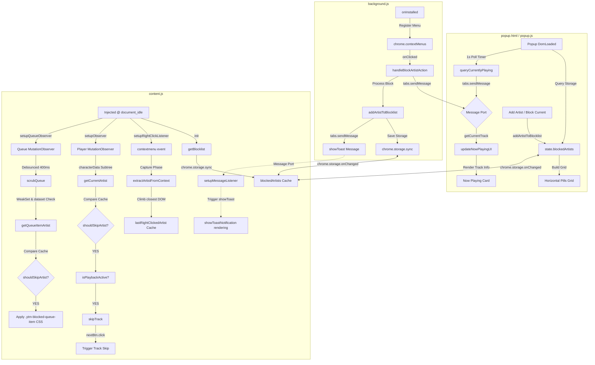

# YTM Block 🚫🎵

An elegant, secure, and lightweight MV3 browser extension for **YouTube Music** (`music.youtube.com`) that automatically skips tracks from blocked artists, scrubs them from your "Up Next" queue, and provides context-aware right-click artist blocking.

Built strictly using vanilla JS, HSL gradients, and CSS glassmorphism, YTM Block delivers a premium visual experience with zero tracker scripts, zero bloat, and fully localized storage synchronization.

---

## 🚀 Key Features

*   **🖱️ Right-Click Context Blocking:** Block any artist by right-clicking a track, artist link, album cover, playlist row, or queue item and choosing **"Block Artist with YTM Block"**. 
    *   *Shadow DOM Workaround:* Built using custom HTML containers to bypass Web Component cloning limits, rendering perfectly every time.
    *   *Sleek Proportions:* Custom-styled to native specifications (`24x24px`, elegant `2px` stroke outline, and `24px` list margins).
    *   *Dual-Event Interception:* Listens to both `mousedown` and `click` in the **capture phase** to beat YouTube Music's quick-closing event loop.
    *   *Non-Destructive Dismissal:* Gracefully closes the menu by triggering a native backdrop or body click, avoiding page lockups or dropdown system crashes.
*   **✨ Dynamic Glass Toast Notifications:** Displays slick, animated floating capsule toast notifications inside the page viewport. Handles three distinct states:
    *   *Success:* Glowing crimson block indicator on successful block events.
    *   *Duplicate:* Yellow warning alerting you if the artist is already blocked, featuring a **clickable "Unblock" action shortcut** inside the toast.
    *   *Failure:* Red warning if no relevant artist name could be extracted.
*   **⚡ Real-Time Auto-Skipping:** Programmatically skips tracks from blocked artists with a sub-second response time. Supports **case-insensitive** and **partial-substring** matching (e.g., blocking `drake` matches `Drake`, `Drake ft. Future`, and `Drake, Lil Baby`).
*   **👁️ "Up Next" Queue Scrubbing:** Scans the queue dynamically to dim blocked songs (set to `0.16` opacity), apply a line-through, and inject an elegant glowing red `[Blocked]` badge.
*   **🛡️ Click Neutralization:** Employs `pointer-events: none` on blocked queue items, making them unclickable so you never accidentally select them.
*   **🔒 Cooldown & Loop Prevention:** Incorporates state-of-the-art protections:
    *   *1.0s Click Cooldown:* Protects against physical double-clicking.
    *   *Stuck DOM Guard:* Halts click events if the webpage fails to transition.
    *   *Consecutive Skips Ceiling:* Locks the engine for 8s if 5 tracks are skipped in a row to protect tab performance on empty queues.
*   **🎨 Premium Glassmorphic Popup UX:** Features a dark obsidian glass card, alphabetic horizontal pills, single-click tag deletion with scale exit transitions, and a **Live Now Playing Card** with one-click blocking.
*   **🔄 Sync Persistence:** Built on `chrome.storage.sync` to sync your blocklist automatically across all browsers signed into the same account.

---

## 📊 System Architecture

---

## 🛠️ Installation Instructions

### Google Chrome & Chromium-based Browsers (Brave, Edge, Opera)
1.  Download or clone this repository to your local system.
2.  Open Chrome and navigate to `chrome://extensions/`.
3.  In the top-right corner, toggle the **Developer mode** switch to **ON**.
4.  In the top-left corner, click **Load unpacked**.
5.  Select the `ytm-block` directory containing `manifest.json`.
6.  The extension is now ready! Pin it to your toolbar.

### Mozilla Firefox
1.  Open Firefox and type `about:debugging` in the URL bar.
2.  Click **This Firefox** in the left sidebar.
3.  Click **Load Temporary Add-on...** under the Temporary Extensions section.
4.  Navigate to the `ytm-block` directory and select `manifest.json` (or the packed `.zip` / `.xpi` archive).
5.  Open `music.youtube.com` and click the extensions icon to configure.

---

## 🛡️ Permissions Breakdown

To guarantee complete privacy, YTM Block requests the absolute minimum permissions required to perform its functions:

| Permission | Scope | Technical Purpose |
| :--- | :--- | :--- |
| `storage` | Persistent Sync | Saves your list of blocked artists securely. Uses `storage.sync` to mirror your blocklist across multiple browsers. |
| `activeTab` | Tab Querying | Used strictly inside the popup to query the active tab's URL and title for checking if you are currently on YouTube Music. |
| `contextMenus` | Context Menu | Safely registers the custom right-click options restricted strictly to YouTube Music viewports. |
| `scripting` | Advanced Script Execution | Declared for potential dynamically executed scripts or advanced frame operations. |
| `https://music.youtube.com/*` | Content Injection | Allows the extension to safely inject `content.js` and spawn `background.js` on pages match. The script is sandboxed and never makes external requests. |

---

## 📷 Screenshots Section

*Add your promotional screenshot assets here. Recommended dimensions: `1280x800` (Chrome Web Store) and `1280x800` (Firefox AMO).*

| 1. Premium Dark Popup UI | 2. Dynamic Unblock Toast Alert |
| :---: | :---: |
|  |  |
| *Elegant Glass Now Playing Panel & tag grid* | *Floating glass capsule alert with unblock action shortcut* |

---

## 🔍 Troubleshooting Guide

#### ❓ The popup displays "Disconnected" and "Open YouTube Music tab"
*   **Cause:** The extension popup cannot find an active tab pointed to `https://music.youtube.com/*`.
*   **Fix:** Open a tab on [music.youtube.com](https://music.youtube.com/), start playing any track, and click the popup again.

#### ❓ Right-clicking an artist link did not detect the correct artist name
*   **Cause:** YouTube Music uses complex DOM element layers. The event capture might have targeted an inner text node or cover image overlay.
*   **Fix:** Ensure you are right-clicking directly on or near the artist title text node. The crawler will traverse upwards using `closest()` to locate the channel metadata link. If extraction yields no name, you will see a red "Could not detect artist name" toast warning.

#### ❓ A song by a blocked artist started playing and didn't skip
*   **Cause:** Playback might be paused, or the content script was injected before the DOM loaded the next-button wrapper.
*   **Fix:** 
    1. Verify that the song is **not paused**. The skip engine is programmatically locked when playback is paused to preserve user focus.
    2. Open your browser console (`Cmd + Option + J` or `Ctrl + Shift + J`) and verify the log: `[YTM Block] next-click cooldown active`.
    3. Make sure the artist's spelling in your blocklist is correct. (Partial matching is supported, but typos will result in a mismatch).

#### ❓ The blocked items inside the "Up Next" queue are not being dimmed
*   **Cause:** YouTube Music uses dynamic virtualization to render elements on scroll. Sometimes the queue container has not been fully rendered in the DOM when the extension initializes.
*   **Fix:** Toggle the **Queue** list icon in the bottom-right corner of the player to force a DOM refresh, or refresh the page. The automatic queue observer will instantly lock onto the container and dim the elements.

---

## 📦 Packaging and Distribution

See [RELEASE_ASSETS.md](release_assets.md) for Chrome Web Store & Firefox AMO packaging instructions, AMO MV3 compatibility wrappers, and the store listing copy.

---

## 📄 License & Privacy

This extension runs **100% locally**. It contains no analytics, no tracker scripts, and never transmits your data or browsing history to external servers. Your blocked artist list remains local to your browser and Chrome profile sync nodes.

Licensed under the MIT License. Developed with care.
