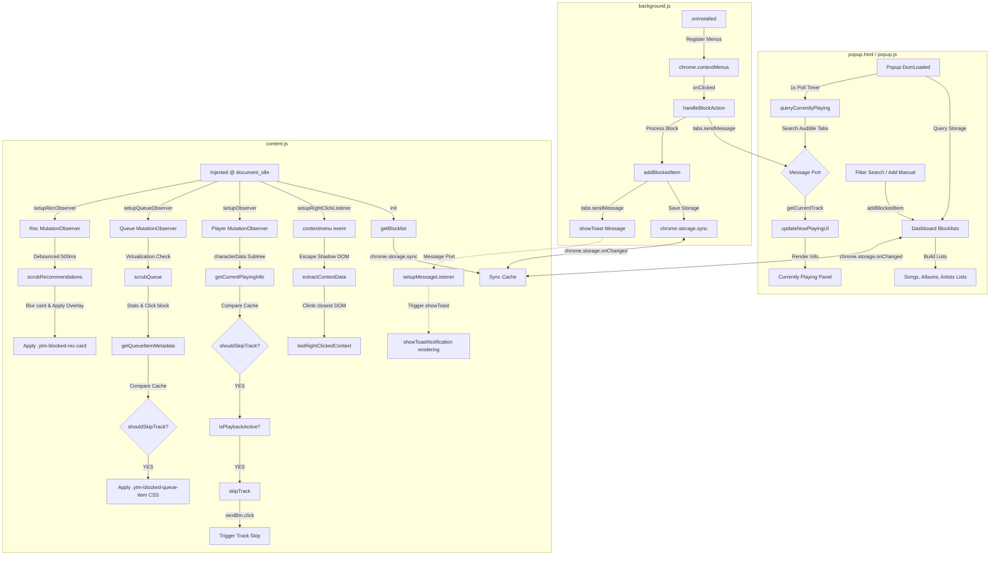

# YTM Block 🚫🎵

An elegant, secure, and lightweight MV3 browser extension for **YouTube Music** (`music.youtube.com`) that automatically skips tracks from blocked artists, songs, and albums, scrubs them from your "Up Next" queue, filters recommendation cards, and provides context-aware right-click entity blocking.

Built strictly using vanilla JS, HSL gradients, and CSS glassmorphism, YTM Block delivers a premium visual experience with zero tracker scripts, zero bloat, and fully localized storage synchronization.

---

## 🚀 Key Features

*   **🖱️ Multi-Entity Right-Click Context Blocking:** Block any resolved **Artist, Song, or Album** by right-clicking on elements (tracks, links, covers, playlists, or player bars). 
    *   *Dynamic Native Menus:* Background service worker updates sub-menu visibility and titles on the fly (e.g., `Block Artist "Drake"`, `Block Album "Views"`, `Block Song "Hotline Bling"`).
    *   *Custom DOM Menus:* Seamlessly injects crimson block shortcuts into YouTube Music's custom popups.
    *   *Shadow DOM Escaping:* Crawls parent/host nodes across Shadow DOM boundaries (`current.parentElement || current.parentNode.host`) to query exact link attributes.
    *   *Non-Destructive Dismissal:* Dismisses menus naturally by triggering a backdrop click, avoiding page layout lockups.
*   **✨ Dynamic Glass Toast Notifications:** Renders elegant, animated floating capsule overlays with responsive state actions:
    *   *Success:* Spawns a crimson notification (e.g., `"Blocked song: Hotline Bling"`) with an inline **Unblock** action button.
    *   *Duplicate:* Yellow capsule informing you the item is already blocked.
    *   *Failure:* Red capsule warning if context extraction yielded no data.
*   **⚡ Prioritized Skip Engine:** Skips tracks automatically with a sub-second transition. Follows strict matching priorities:
    1. **Blocked Songs:** Matches exactly or fuzzily (ignores punctuation and accents, cleans bracketed text like `[Remix]` or `(feat. ...)`).
    2. **Blocked Albums:** Matches exact or substring album titles.
    3. **Blocked Artists:** Matches partial substrings to cover collaborative tracks or split credits.
*   **👁️ Queue Intelligence:** Scans "Up Next" lists dynamically, employing virtualization-safe cache checks.
    *   *Visual Suppression:* Flags blocked tracks with a red left border, dimmed `0.35` opacity, line-through text, and an absolute-positioned `"BLOCKED"` capsule badge.
    *   *Queue Stats Counter:* Injects a sleek stats capsule (e.g., `"3 blocked tracks hidden"`) into the queue header.
    *   *Click Intercept:* Neutralizes user clicks on flagged tracks using capture-phase event blockers, spawning a warning toast notification instead.
*   **🔍 Layout-Safe Recommendation Filtering:** Suppresses blocked items across home feeds, mixes, shelves, and search results.
    *   *Grid Safeguard:* Instead of collapsing elements (which breaks column distributions), it blurs card contents (`12px`) and centers a custom translucent overlay reading `"Blocked by YTM Block"`.
*   **🔒 Cooldown & Loop Protections:** Advanced stability guardrails:
    *   *1s Skip Cooldown:* Prevents physical and automated skip double-triggering.
    *   *Stuck DOM Protection:* Inhibits transition attempts if a track switch fails.
    *   *Consecutive Skips Lock:* Pauses skipping for 8s if 5 tracks are skipped sequentially, protecting browser tabs from infinite autoplay loops.
*   **📊 Categorized Blocking Dashboard Popup:** Redesigned popup UI displaying Blocked Songs, Albums, and Artists simultaneously.
    *   *Real-time Filters:* The search box instantly filters all lists as you type.
    *   *One-Click Blockers:* The Currently Playing panel displays live track data queried from tabs, sorting them dynamically (prioritizing audible/active tabs) with standalone add buttons.
*   **🔄 Sync Persistence:** Operates on `chrome.storage.sync` to sync your blocklists automatically across all browsers signed into your account.

---

## 📊 System Architecture

---

## 🛠️ Installation Instructions

### Google Chrome & Chromium-based Browsers (Brave, Edge, Opera)
1.  Download or clone this repository to your local system.
2.  Open Chrome and navigate to `chrome://extensions/`.
3.  In the top-right corner, toggle the **Developer mode** switch to **ON**.
4.  In the top-left corner, click **Load unpacked**.
5.  Select the `ytm-block` directory containing `manifest.json`.
6.  The extension is now ready! Pin it to your toolbar.

### Mozilla Firefox
1.  Open Firefox and type `about:debugging` in the URL bar.
2.  Click **This Firefox** in the left sidebar.
3.  Click **Load Temporary Add-on...** under the Temporary Extensions section.
4.  Navigate to the `ytm-block` directory and select `manifest.json` (or the packed `.zip` / `.xpi` archive).
5.  Open `music.youtube.com` and click the extensions icon to configure.

---

## 🛡️ Permissions Breakdown

To guarantee complete privacy, YTM Block requests the absolute minimum permissions required to perform its functions:

| Permission | Scope | Technical Purpose |
| :--- | :--- | :--- |
| `storage` | Persistent Sync | Saves your list of blocked artists securely. Uses `storage.sync` to mirror your blocklist across multiple browsers. |
| `activeTab` | Tab Querying | Used strictly inside the popup to query the active tab's URL and title for checking if you are currently on YouTube Music. |
| `contextMenus` | Context Menu | Safely registers the custom right-click options restricted strictly to YouTube Music viewports. |
| `scripting` | Advanced Script Execution | Declared for potential dynamically executed scripts or advanced frame operations. |
| `https://music.youtube.com/*` | Content Injection | Allows the extension to safely inject `content.js` and spawn `background.js` on pages match. The script is sandboxed and never makes external requests. |

---

## 📷 Screenshots Section

*Add your promotional screenshot assets here. Recommended dimensions: `1280x800` (Chrome Web Store) and `1280x800` (Firefox AMO).*

| 1. Premium Dark Popup UI | 2. Dynamic Unblock Toast Alert |
| :---: | :---: |
|  |  |
| *Elegant Glass Now Playing Panel & tag grid* | *Floating glass capsule alert with unblock action shortcut* |

---

## 🔍 Troubleshooting Guide

#### ❓ The popup displays "Disconnected" and "Open YouTube Music tab"
*   **Cause:** The extension popup cannot find an active tab pointed to `https://music.youtube.com/*`.
*   **Fix:** Open a tab on [music.youtube.com](https://music.youtube.com/), start playing any track, and click the popup again.

#### ❓ Right-clicking an artist link did not detect the correct artist name
*   **Cause:** YouTube Music uses complex DOM element layers. The event capture might have targeted an inner text node or cover image overlay.
*   **Fix:** Ensure you are right-clicking directly on or near the artist title text node. The crawler will traverse upwards using `closest()` to locate the channel metadata link. If extraction yields no name, you will see a red "Could not detect artist name" toast warning.

#### ❓ A song by a blocked artist started playing and didn't skip
*   **Cause:** Playback might be paused, or the content script was injected before the DOM loaded the next-button wrapper.
*   **Fix:** 
    1. Verify that the song is **not paused**. The skip engine is programmatically locked when playback is paused to preserve user focus.
    2. Open your browser console (`Cmd + Option + J` or `Ctrl + Shift + J`) and verify the log: `[YTM Block] next-click cooldown active`.
    3. Make sure the artist's spelling in your blocklist is correct. (Partial matching is supported, but typos will result in a mismatch).

#### ❓ The blocked items inside the "Up Next" queue are not being dimmed
*   **Cause:** YouTube Music uses dynamic virtualization to render elements on scroll. Sometimes the queue container has not been fully rendered in the DOM when the extension initializes.
*   **Fix:** Toggle the **Queue** list icon in the bottom-right corner of the player to force a DOM refresh, or refresh the page. The automatic queue observer will instantly lock onto the container and dim the elements.

---

## 📦 Packaging and Distribution

See [RELEASE_ASSETS.md](release_assets.md) for Chrome Web Store & Firefox AMO packaging instructions, AMO MV3 compatibility wrappers, and the store listing copy.

---

## 📄 License & Privacy

This extension runs **100% locally**. It contains no analytics, no tracker scripts, and never transmits your data or browsing history to external servers. Your blocked artist list remains local to your browser and Chrome profile sync nodes.

Licensed under the MIT License. Developed with care.
